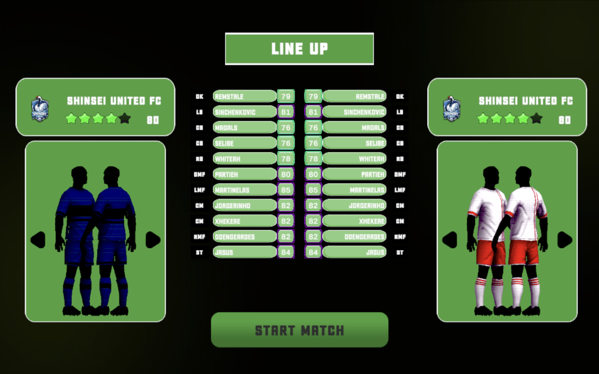
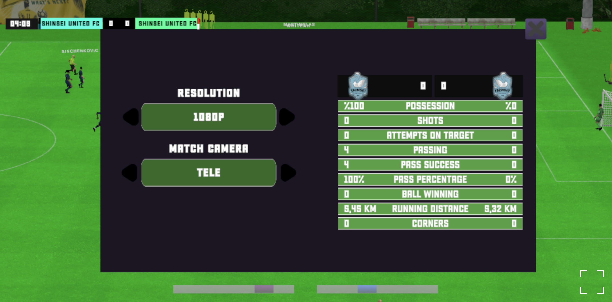

# Fulbo Beta 1.0

**▶ Play it in your browser: [diegodiaz808.github.io/fulbo-beta1](https://diegodiaz808.github.io/fulbo-beta1/)**

Fulbo is a football game for the [fulbo.fun](https://fulbo.fun) community. This is the full Beta 1.0, compiled to WebGL - the complete game, playable with no install.






## About this beta

- Built with **Unity (URP)**, deployed as a WebGL build with Addressables for streamed content.
- Custom teams, kits and player database built for the Fulbo universe.
- Beta 2 is in development with a new player-creation system.

## Tech notes

The gameplay layer is built on a licensed football simulation framework from the Unity Asset Store, customized and content-configured for Fulbo; per its license, the framework's source is not redistributed here - this repo ships the compiled, distributable build. The Fulbo ecosystem around the game is in my other repos: [content pipeline](https://github.com/diegodiaz808/fulbo-scripts), [video factory](https://github.com/diegodiaz808/fulbo-video-mixer) and [community Discord bots](https://github.com/diegodiaz808/discord-game-bots).

## Run locally

WebGL builds need a web server (browsers block `file://` loading):

```bash
python3 -m http.server 8000
# open http://localhost:8000
```
